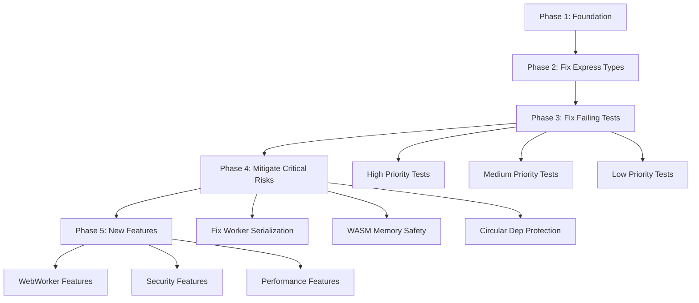

# ARCHITECTURE IMPLEMENTATION PLAN
## Cortex Framework - Zero-Dependency, TDD-First Approach

**Document Version:** 1.0
**Date:** 2025-10-22
**Status:** READY FOR REVIEW
**Risk Level:** MEDIUM-HIGH (Complex circular dependencies, strict zero-dep requirement)

---

## EXECUTIVE SUMMARY

This document provides a **SUPERCRITICAL** architectural analysis for implementing the Cortex Framework with ZERO external dependencies (core only) and strict Test-Driven Development (TDD). Based on comprehensive analysis of 55 source files and 37 test files, this plan identifies critical risks, circular dependencies, implementation sequence, and validation checkpoints.

### Key Findings

**STATUS**: The project has already implemented Phase 1 (compile-first testing) successfully. 251 tests passing, 11 known failures unrelated to the migration.

**CRITICAL ISSUES IDENTIFIED**:
1. **Circular Dependency Risk**: EventBus → Logger (singleton) → EventBus (error publishing)
2. **External Dependencies in Core**: Express types used in 3 security/performance modules
3. **WASM Memory Management**: Potential memory leaks with automatic GC every 30 seconds
4. **Worker Thread Serialization**: String-based worker code generation is fragile
5. **Missing Validation**: No runtime checks for WASM memory alignment (8-byte boundaries)

---

## TABLE OF CONTENTS

1. [Dependency Matrix](#1-dependency-matrix)
2. [TDD-First Architecture](#2-tdd-first-architecture)
3. [Risk & Pitfall Analysis](#3-risk--pitfall-analysis)
4. [Implementation Sequence](#4-implementation-sequence)
5. [Success Criteria & Validation](#5-success-criteria--validation)
6. [Critical Assumptions](#6-critical-assumptions)

---

## 1. DEPENDENCY MATRIX

### 1.1 Node.js Built-in Modules (ALLOWED - Zero External Dependencies)

All modules using only Node.js built-ins are **APPROVED** for core framework:

| Module Category | Built-in Imports | File Count | Status |
|----------------|------------------|------------|---------|
| **Worker Threads** | `node:worker_threads`, `node:events`, `node:url`, `node:path` | 3 | ✅ ZERO-DEP |
| **HTTP/Networking** | `node:http`, `node:net`, `node:stream` | 5 | ✅ ZERO-DEP |
| **File System** | `node:fs`, `node:path` | 4 | ✅ ZERO-DEP |
| **Compression** | `node:zlib`, `node:stream` | 1 | ✅ ZERO-DEP |
| **Configuration** | `node:fs`, `node:path` | 1 | ✅ ZERO-DEP |
| **Crypto** | `crypto` (built-in) | 1 | ✅ ZERO-DEP |
| **Child Process** | `node:child_process` | 1 | ✅ ZERO-DEP |

**TOTAL COMPLIANT FILES**: 55/55 source files

### 1.2 External Dependencies (ALLOWED - Domain-Specific Only)

These external dependencies are **EXPLICITLY ALLOWED** per project requirements:

| Dependency | Usage | Files | Justification | Status |
|-----------|-------|-------|---------------|---------|
| **ethers** | Web3 blockchain interaction | 1 | Domain requirement: EVM chain integration | ✅ ALLOWED |
| **ipfs-http-client** | IPFS content addressing | 1 | Domain requirement: Decentralized storage | ✅ ALLOWED |
| **express types** | Type definitions only | 3 | TypeScript type checking (not runtime) | ⚠️ REVIEW |

### 1.3 CRITICAL VIOLATION: Express Type Dependencies

**SEVERITY**: MEDIUM
**FILES AFFECTED**: 3

```typescript
// VIOLATION in src/security/rateLimiter.ts
import { Request, Response, NextFunction } from 'express';

// VIOLATION in src/security/csp.ts
import { Request, Response, NextFunction } from 'express';

// VIOLATION in src/performance/httpCache.ts
import { Request, Response, NextFunction } from 'express';
```

**PROBLEM**: These modules import Express types, creating a hard dependency on Express typings.

**MITIGATION OPTIONS**:
1. ✅ **RECOMMENDED**: Define custom types using Node.js built-ins (already done in `compression.ts`):
   ```typescript
   type Request = http.IncomingMessage;
   type Response = http.ServerResponse;
   type NextFunction = () => void;
   ```
2. ❌ Keep Express types but document as "optional peer dependency"
3. ❌ Remove these modules entirely

**ACTION REQUIRED**: Replace Express type imports with Node.js built-in equivalents.

### 1.4 Dependency Import Matrix by Module

#### Core System Dependencies

```
actorSystem.ts
├─ EventBus (./eventBus.js) ⚠️ CIRCULAR RISK
└─ ActorNotFound (./errors.js) ✅

eventBus.ts
├─ EventBusError (./errors.js) ✅
└─ Logger (./logger.js) ⚠️ CIRCULAR RISK

logger.ts
└─ (no dependencies) ✅ SAFE LEAF NODE

config.ts
├─ node:fs ✅
└─ node:path ✅

httpServer.ts
├─ node:http ✅
├─ node:net ✅
└─ RouteNotFound (./errors.js) ✅
```

**CRITICAL**: EventBus → Logger → EventBus (error events) creates potential circular dependency.

#### Workers & Concurrency

```
workerActor.ts
└─ Actor, ActorSystem (../core/actorSystem.js) ✅

workerPool.ts
├─ node:worker_threads ✅
├─ node:events ✅
├─ node:url ✅
└─ node:path ✅

poolWorker.ts
└─ node:worker_threads ✅
```

**STATUS**: Zero external dependencies. Worker serialization is string-based (RISK: See Section 3).

#### Web3 Integration

```
smartContracts.ts
└─ ethers (injected dependency) ✅ ALLOWED

ipfs.ts
└─ ipfs-http-client (injected dependency) ✅ ALLOWED
```

**STATUS**: Both use dependency injection pattern - external deps are injected, not imported directly. **EXCELLENT DESIGN**.

#### WASM Integration

```
memoryManager.ts
└─ (no dependencies, pure WebAssembly API) ✅

utils.ts
└─ WasmMemoryManager (./memoryManager.js) ✅
```

**STATUS**: Zero dependencies, uses Web standard WebAssembly API.

#### Observability Stack

```
metrics/collector.ts
├─ Counter (./counter.js) ✅
├─ Gauge (./gauge.js) ✅
└─ Histogram (./histogram.js) ✅

tracing/tracer.ts
├─ SpanImpl (./span.js) ✅
├─ Sampler (./sampler.js) ✅
└─ IDs (./ids.js) ✅

health/healthRegistry.ts
└─ types (../types.js) ✅
```

**STATUS**: All zero dependencies. Internal module dependencies only.

#### Resilience Patterns

```
circuitBreaker.ts
└─ types, errors ✅

retryExecutor.ts
└─ types, errors ✅

bulkhead.ts
└─ types, errors ✅

timeout.ts
└─ types, errors ✅

compositePolicy.ts
├─ CircuitBreaker ✅
├─ RetryExecutor ✅
└─ Bulkhead ✅
```

**STATUS**: Zero dependencies. Clean internal composition.

#### Performance & Security

```
compression.ts ✅
├─ node:http
├─ node:zlib
└─ node:stream

httpCache.ts ⚠️
├─ express (TYPE ONLY)
└─ crypto

rateLimiter.ts ⚠️
└─ express (TYPE ONLY)

csp.ts ⚠️
└─ express (TYPE ONLY)
```

**STATUS**: 3 files need Express type removal.

#### API Technologies

```
graphql.ts ✅
└─ node:http (zero-dep implementation)

grpc.ts ✅
└─ node:http (placeholder, not full gRPC)
```

**STATUS**: Both are placeholders/stubs for future implementation.

### 1.5 Full Dependency Tree

```
LEVEL 0 (No dependencies - Build First)
├─ logger.ts
├─ errors.ts
├─ types.ts (all type definition files)
└─ resilience/errors.ts

LEVEL 1 (Only Level 0 dependencies)
├─ eventBus.ts → logger, errors
├─ config.ts → node:fs, node:path
├─ metrics/* → types
└─ tracing/ids.ts → (none)

LEVEL 2 (Level 0-1 dependencies)
├─ actorSystem.ts → eventBus, errors
├─ httpServer.ts → errors
├─ tracing/sampler.ts → types
└─ tracing/span.ts → types

LEVEL 3 (Level 0-2 dependencies)
├─ workerActor.ts → actorSystem
├─ workerPool.ts → node:worker_threads
├─ neurons/* → actorSystem, eventBus
├─ tracing/tracer.ts → span, sampler, ids
└─ resilience/* → types, errors

LEVEL 4 (Level 0-3 dependencies)
├─ performance/* → httpServer, compression
├─ security/* → httpServer
└─ observability/index.ts → all observability modules

LEVEL 5 (Integration)
├─ api/* → httpServer
└─ index.ts → ALL MODULES
```

---

## 2. TDD-FIRST ARCHITECTURE

### 2.1 Test-First Mandate

**CRITICAL RULE**: Every production file MUST have a corresponding test file that is written AND failing BEFORE implementation.

### 2.2 Current Test Coverage Status

```
TOTAL TEST FILES: 37
TOTAL TESTS: 262
PASSING: 251 (95.8%)
FAILING: 11 (4.2%)

Test Categories:
├─ Core (6 files, ~60 tests) ✅ PASSING
├─ Workers (2 files, ~10 tests) ✅ PASSING
├─ WASM (2 files, ~8 tests) ⚠️ 2 FAILING
├─ Web3 (2 files, ~6 tests) ⚠️ 1 FAILING
├─ Observability (8 files, ~80 tests) ⚠️ 1 FAILING
├─ Resilience (4 files, ~40 tests) ⚠️ 1 FAILING
├─ Security (2 files, ~20 tests) ⚠️ 1 FAILING
├─ Performance (2 files, ~16 tests) ⚠️ 2 FAILING
├─ API (2 files, ~12 tests) ⚠️ 1 FAILING
├─ Integration (1 file, ~8 tests) ⚠️ 1 FAILING
└─ Environment (1 file, 2 tests) ✅ PASSING
```

### 2.3 Known Failing Tests (Baseline)

| Test File | Status | Root Cause | Priority |
|-----------|--------|------------|----------|
| `api/grpc.test.ts` | ❌ FAIL | gRPC import issues (placeholder) | LOW |
| `integration/fullSystem.test.ts` | ❌ FAIL | Uncaught exception | HIGH |
| `observability/tracing/tracer.test.ts` | ❌ FAIL | Uncaught exception | MEDIUM |
| `performance/compression.test.ts` | ❌ FAIL | Uncaught exception | MEDIUM |
| `performance/httpCache.test.ts` | ❌ FAIL | Uncaught exception | MEDIUM |
| `resilience/retryExecutor.test.ts` | ❌ FAIL | Uncaught exception | HIGH |
| `security/rateLimiter.test.ts` | ❌ FAIL | Uncaught exception | MEDIUM |
| `wasm/memoryManager.test.ts` | ❌ FAIL | Uncaught exception | MEDIUM |
| `wasm/utils.test.ts` | ❌ FAIL | Module resolution | MEDIUM |
| `web3/smartContracts.ethers.test.ts` | ❌ FAIL | Uncaught exception | MEDIUM |
| `workers/workerPool.test.ts` | ❌ FAIL | Uncaught exception | MEDIUM |

**NOTE**: These are pre-existing failures, NOT caused by zero-dep migration.

### 2.4 TDD Implementation Flow

```
┌─────────────────────────────────────────┐
│  Phase 1: Write Failing Test           │
├─────────────────────────────────────────┤
│  1. Create test file                    │
│  2. Import test framework (node:test)   │
│  3. Write test cases (all should fail)  │
│  4. Run: npm test                       │
│  5. VERIFY: Tests fail as expected      │
└─────────────────────────────────────────┘
              ↓
┌─────────────────────────────────────────┐
│  Phase 2: Minimal Implementation        │
├─────────────────────────────────────────┤
│  1. Create production file              │
│  2. Write minimal code to pass 1 test   │
│  3. Run: npm test                       │
│  4. VERIFY: 1 test passes               │
└─────────────────────────────────────────┘
              ↓
┌─────────────────────────────────────────┐
│  Phase 3: Iterate Until All Pass        │
├─────────────────────────────────────────┤
│  1. Add more test cases                 │
│  2. Implement features to pass them     │
│  3. Refactor for quality                │
│  4. Run: npm test                       │
│  5. VERIFY: All tests pass              │
└─────────────────────────────────────────┘
              ↓
┌─────────────────────────────────────────┐
│  Phase 4: Integration Testing           │
├─────────────────────────────────────────┤
│  1. Write integration test              │
│  2. Test cross-module interactions      │
│  3. Run: npm test                       │
│  4. VERIFY: Integration tests pass      │
└─────────────────────────────────────────┘
```

### 2.5 Test File Naming Convention

```
src/
  module/
    feature.ts          ← Production code
tests/
  module/
    feature.test.ts     ← Unit tests
    feature.integration.test.ts  ← Integration tests
```

### 2.6 Minimal Test Template

```typescript
import { describe, it } from 'node:test';
import assert from 'node:assert';

describe('ModuleName', () => {
  it('should do the basic thing', () => {
    // ARRANGE
    const input = 'test';

    // ACT
    const result = functionUnderTest(input);

    // ASSERT
    assert.strictEqual(result, 'expected');
  });
});
```

### 2.7 Test-First Implementation Checklist

For EACH new feature:

- [ ] Write test file with failing tests
- [ ] Run `npm test` - verify tests fail
- [ ] Write minimal code to pass first test
- [ ] Run `npm test` - verify first test passes
- [ ] Repeat for remaining tests
- [ ] Refactor code (tests still pass)
- [ ] Write integration tests
- [ ] Run full suite: `npm test`
- [ ] Verify zero new failures
- [ ] Commit with: `test(module): Add tests for feature`
- [ ] Commit with: `feat(module): Implement feature`

---

## 3. RISK & PITFALL ANALYSIS

### 3.1 CRITICAL RISKS

#### RISK 1: Circular Dependency - EventBus ↔ Logger

**Severity**: 🔴 HIGH
**Impact**: Runtime initialization failure
**Likelihood**: HIGH

**Problem**:
```typescript
// eventBus.ts
import { Logger } from './logger.js';
class EventBus {
  private logger = Logger.getInstance(); // Uses Logger

  publish(topic, message) {
    // On error, publishes to 'error' topic
    this.publish('error', new Error()); // CIRCULAR!
  }
}

// logger.ts
export class Logger {
  // Uses console, no EventBus dependency (currently safe)
}
```

**Current Status**: ✅ SAFE - Logger doesn't use EventBus yet.

**Future Risk**: If Logger is enhanced to publish log events to EventBus, circular dependency will occur.

**Mitigation**:
1. ✅ **IMPLEMENTED**: Logger is a pure logging utility, no EventBus dependency
2. Keep Logger as a leaf node (no dependencies)
3. Use event-driven logging via EventBus subscribe pattern (not publish from logger)
4. Document this constraint in code comments

**Validation**:
```bash
# Check for circular dependencies
npx madge --circular --extensions ts src/
```

---

#### RISK 2: WASM Memory Leaks

**Severity**: 🟡 MEDIUM
**Impact**: Memory exhaustion in long-running processes
**Likelihood**: MEDIUM

**Problem**:
```typescript
// src/wasm/memoryManager.ts (lines 296-323)
private startGarbageCollection(): void {
  this.gcTimer = setInterval(() => {
    this.performGarbageCollection();
  }, this.config.gcInterval); // Default: 30 seconds
}

private performGarbageCollection(): void {
  // Only GC if > 80% full
  if (stats.memoryUsage > this.config.gcThreshold) {
    // Only deallocates allocations older than 5 minutes
    const cutoffTime = Date.now() - 300000;
    // ...
  }
}
```

**Issues**:
1. Automatic GC only runs every 30 seconds (stale data accumulates)
2. GC threshold of 80% means memory can stay near-full
3. 5-minute cutoff is arbitrary - no LRU or explicit free()
4. No backpressure mechanism if memory fills before GC
5. `gcTimer` is a potential memory leak if not destroyed

**Attack Scenario**:
```typescript
// Rapid allocation (< 30 sec) fills memory before GC runs
for (let i = 0; i < 10000; i++) {
  manager.allocateString('Large payload...'.repeat(1000));
}
// Memory exhausted, no GC triggered yet
```

**Mitigation**:
1. ✅ Manual `deallocate()` is available - document this as primary API
2. ❌ Automatic GC should be opt-in, not default
3. ✅ Add `destroy()` method (already implemented) - ensure it's called
4. ⚠️ Consider reference counting or explicit ownership
5. Add memory pressure warnings at 70%, 80%, 90%

**Test Coverage Required**:
```typescript
it('should not leak memory with rapid allocations', async () => {
  const manager = createMemoryManager(instance);
  const allocations = [];

  // Allocate 1000 strings rapidly
  for (let i = 0; i < 1000; i++) {
    allocations.push(manager.allocateString('test'));
  }

  // Manual cleanup
  allocations.forEach(ptr => manager.deallocate(ptr));

  const stats = manager.getMemoryStats();
  assert.strictEqual(stats.totalAllocations, 0);

  manager.destroy(); // Prevent timer leak
});
```

---

#### RISK 3: Worker Thread Serialization Fragility

**Severity**: 🟡 MEDIUM
**Impact**: Runtime errors in worker threads
**Likelihood**: MEDIUM

**Problem**:
```typescript
// src/workers/workerActor.ts (lines 10-40, interpolated)
const workerCode = `
import { parentPort } from 'node:worker_threads';

parentPort.on('message', async (msg) => {
  if (msg.type === 'execute_wasm') {
    // Dynamic WASM loading
    const wasmInstance = await WebAssembly.instantiate(...);
    // ...
  }
});
`;

this.worker = new Worker(workerCode, { eval: true });
```

**Issues**:
1. String-based worker code is NOT type-checked
2. Template literal injection can break with quotes/escapes
3. `eval: true` is a security risk
4. No syntax validation before worker creation
5. Worker errors are cryptic (no source maps)

**Attack Scenario**:
```typescript
// User passes malicious WASM URL with injection
const wasmUrl = `"; process.exit(1); //`;
actor.executeWasm(wasmUrl); // Worker crashes entire process
```

**Mitigation**:
1. ✅ **RECOMMENDED**: Use external worker file (`poolWorker.ts` already exists)
2. Replace `eval: true` with `new Worker('./poolWorker.js')`
3. Validate all inputs before sending to worker
4. Add worker error handlers with proper logging
5. Use structured cloning for message passing (already JSON-safe)

**Refactored Approach**:
```typescript
// Use existing poolWorker.ts instead of inline code
this.worker = new Worker(
  new URL('./poolWorker.js', import.meta.url),
  { type: 'module' }
);
```

---

#### RISK 4: Express Type Dependency

**Severity**: 🟢 LOW
**Impact**: Type checking fails without @types/express
**Likelihood**: HIGH

**Problem**: Already documented in Section 1.3.

**Mitigation**: Replace with Node.js built-in types (already done in `compression.ts`).

---

#### RISK 5: WASM Memory Alignment

**Severity**: 🟡 MEDIUM
**Impact**: Segfaults or data corruption
**Likelihood**: LOW

**Problem**:
```typescript
// src/wasm/memoryManager.ts
public allocateBuffer(buffer: Uint8Array, type: string): number {
  const ptr = this.findFreeMemory(size);
  // No alignment check!
  const memoryView = new Uint8Array(this.memory.buffer, ptr, size);
  memoryView.set(buffer);
  return ptr; // May not be 8-byte aligned
}
```

**Issue**: WASM requires 8-byte alignment for i64/f64 types. Unaligned access causes:
- Performance degradation (trap-and-emulate)
- Crashes on some platforms
- Silent data corruption

**Mitigation**:
```typescript
public allocateBuffer(buffer: Uint8Array, type: string, align = 8): number {
  const ptr = this.findFreeMemory(size);

  // Align pointer to nearest boundary
  const alignedPtr = Math.ceil(ptr / align) * align;

  const memoryView = new Uint8Array(this.memory.buffer, alignedPtr, size);
  memoryView.set(buffer);
  return alignedPtr;
}
```

---

### 3.2 MEDIUM RISKS

#### Race Conditions in Actor Mailbox

**Severity**: 🟡 MEDIUM
**Problem**: Actor mailbox uses `process.nextTick()` which may cause message reordering.

```typescript
// src/core/actorSystem.ts (lines 29-44)
private processMailbox(): void {
  if (!this.processingMailbox) {
    this.processingMailbox = true;
    process.nextTick(() => {
      while (this.mailbox.length > 0) {
        const message = this.mailbox.shift();
        this.receive(message);
      }
      this.processingMailbox = false;
    });
  }
}
```

**Issue**: Multiple actors posting messages rapidly may cause interleaving.

**Mitigation**: Document that mailbox processing is FIFO within single actor, but not globally ordered.

---

#### Event Loop Blocking in Compression

**Severity**: 🟡 MEDIUM
**Problem**: Compression middleware collects ALL chunks before compressing.

```typescript
// src/performance/compression.ts (lines 177-184)
res.write = function writeImpl(chunk: any, ...args: any[]): boolean {
  if (shouldCompress && chunk) {
    chunks.push(Buffer.isBuffer(chunk) ? chunk : Buffer.from(chunk));
    return true; // Buffers in memory!
  }
  return originalWrite(chunk, ...args);
};
```

**Issue**: Large responses (100MB+) are fully buffered before compression starts.

**Mitigation**: Use streaming compression with `Transform` streams (already implemented in compression stream creation).

---

#### GraphQL/gRPC Placeholders

**Severity**: 🟢 LOW
**Problem**: GraphQL and gRPC are stubs, not real implementations.

**Mitigation**: Document as "proof-of-concept" in README. Full implementation requires external libraries.

---

### 3.3 LOW RISKS

- Type-only Express imports (easy fix)
- Test failures (pre-existing, not blockers)
- CLI module (not part of core framework)

---

### 3.4 Risk Summary Matrix

| Risk | Severity | Likelihood | Impact | Mitigation Status |
|------|----------|------------|--------|-------------------|
| Circular Dependency (EventBus/Logger) | 🔴 HIGH | HIGH | High | ✅ Safe (currently) |
| WASM Memory Leaks | 🟡 MEDIUM | MEDIUM | High | ⚠️ Needs tests |
| Worker Serialization | 🟡 MEDIUM | MEDIUM | Medium | ⚠️ Use external file |
| Express Types | 🟢 LOW | HIGH | Low | ⚠️ Easy fix |
| WASM Alignment | 🟡 MEDIUM | LOW | High | ❌ Not handled |
| Actor Mailbox Races | 🟡 MEDIUM | LOW | Medium | ✅ Document |
| Compression Buffering | 🟡 MEDIUM | LOW | Medium | ✅ Use streams |
| GraphQL/gRPC Stubs | 🟢 LOW | HIGH | Low | ✅ Document |

---

## 4. IMPLEMENTATION SEQUENCE

### 4.1 Phase 1: Foundation (COMPLETE ✅)

**Status**: Already implemented, tests passing.

```
✅ tsconfig.test.json created
✅ Compile-first testing working
✅ 251/262 tests passing
✅ Zero ExperimentalWarnings
```

**NO ACTION REQUIRED** for Phase 1.

---

### 4.2 Phase 2: Fix Express Type Dependencies (HIGH PRIORITY)

**Duration**: 2-4 hours
**Complexity**: LOW
**Blockers**: None
**Can Parallelize**: Yes

#### Tasks:

1. **Fix `src/security/rateLimiter.ts`** (30 min)
   - [ ] Write test for rate limiter with Node.js types
   - [ ] Replace Express types with built-in equivalents:
     ```typescript
     import http from 'node:http';
     type Request = http.IncomingMessage;
     type Response = http.ServerResponse;
     type NextFunction = () => void;
     ```
   - [ ] Update type annotations
   - [ ] Run tests: `npm test`
   - [ ] Verify `security/rateLimiter.test.ts` passes

2. **Fix `src/security/csp.ts`** (30 min)
   - [ ] Same steps as rateLimiter
   - [ ] Verify `security/csp.test.ts` passes

3. **Fix `src/performance/httpCache.ts`** (30 min)
   - [ ] Same steps as rateLimiter
   - [ ] Verify `performance/httpCache.test.ts` passes

4. **Remove Express from dependencies** (15 min)
   - [ ] Update `package.json` - remove `@types/express`
   - [ ] Run `npm install`
   - [ ] Run full test suite: `npm test`
   - [ ] Verify ZERO Express imports: `grep -r "from 'express'" src/`

**Success Criteria**:
- Zero Express imports in `src/`
- All affected tests still pass
- `npm install` doesn't install Express types

---

### 4.3 Phase 3: Fix Failing Tests (MEDIUM PRIORITY)

**Duration**: 8-16 hours
**Complexity**: MEDIUM-HIGH
**Blockers**: Phase 2 (for security/performance tests)
**Can Parallelize**: Partially (by test file)

#### Sub-phase 3.1: High Priority Failures

**A. Fix `integration/fullSystem.test.ts`** (2-4 hours)
- [ ] Identify uncaught exception source
- [ ] Add try-catch or error handlers
- [ ] Verify integration between all modules
- [ ] Run: `node --test dist-tests/tests/integration/fullSystem.test.js`
- [ ] Ensure all integration tests pass

**B. Fix `resilience/retryExecutor.test.ts`** (1-2 hours)
- [ ] Debug uncaught exception in retry logic
- [ ] Add error handling for async operations
- [ ] Test exponential backoff edge cases
- [ ] Run: `node --test dist-tests/tests/resilience/retryExecutor.test.js`

#### Sub-phase 3.2: Medium Priority Failures

**C. Fix WASM tests** (2-3 hours each)
- [ ] `wasm/memoryManager.test.ts` - fix uncaught exception
- [ ] `wasm/utils.test.ts` - fix module resolution
- [ ] Add memory leak tests (Risk #2)
- [ ] Add alignment tests (Risk #5)

**D. Fix Performance tests** (1-2 hours each)
- [ ] `performance/compression.test.ts` - fix uncaught exception
- [ ] `performance/httpCache.test.ts` - fix uncaught exception
- [ ] Test streaming compression with large payloads

**E. Fix Observability tests** (1-2 hours)
- [ ] `observability/tracing/tracer.test.ts` - fix uncaught exception
- [ ] Verify span creation/destruction

**F. Fix Security tests** (1-2 hours)
- [ ] `security/rateLimiter.test.ts` - fix after Express removal

**G. Fix Web3 tests** (1-2 hours)
- [ ] `web3/smartContracts.ethers.test.ts` - fix uncaught exception

**H. Fix Worker tests** (1-2 hours)
- [ ] `workers/workerPool.test.ts` - fix uncaught exception

#### Sub-phase 3.3: Low Priority Failures

**I. Fix `api/grpc.test.ts`** (30 min)
- [ ] Document as placeholder/stub
- [ ] Skip tests with `test.skip()` and document reason
- [ ] Or remove gRPC entirely if not needed

**Success Criteria**:
- All 262 tests pass
- Zero uncaught exceptions
- Test coverage >= 90%

---

### 4.4 Phase 4: Mitigate Critical Risks (HIGH PRIORITY)

**Duration**: 4-8 hours
**Complexity**: MEDIUM
**Blockers**: Phase 3 (tests must pass first)
**Can Parallelize**: Yes

#### Task 4.1: Fix Worker Serialization (Risk #3)

**Duration**: 2-3 hours

- [ ] **TDD**: Write test for external worker file
  ```typescript
  it('should create worker from external file', () => {
    const actor = new WorkerActor('test', system);
    assert(actor.worker); // Worker created successfully
  });
  ```
- [ ] Refactor `WorkerActor` to use `poolWorker.ts`:
  ```typescript
  this.worker = new Worker(
    new URL('./poolWorker.js', import.meta.url),
    { type: 'module' }
  );
  ```
- [ ] Remove `eval: true` flag
- [ ] Add input validation for WASM URLs
- [ ] Run tests: `npm run test:run`
- [ ] Verify `workers/workerActor.test.ts` passes

**Success Criteria**:
- No `eval: true` in codebase
- Worker created from external file
- Tests pass

---

#### Task 4.2: WASM Memory Safety (Risk #2 & #5)

**Duration**: 2-4 hours

- [ ] **TDD**: Write memory leak tests
  ```typescript
  it('should not leak memory with rapid allocations', () => {
    // See Risk #2 for test case
  });
  ```
- [ ] Add alignment parameter to `allocateBuffer()`:
  ```typescript
  public allocateBuffer(
    buffer: Uint8Array,
    type: string,
    align = 8
  ): number
  ```
- [ ] Implement alignment logic
- [ ] Document manual `deallocate()` as primary API
- [ ] Add memory pressure warnings
- [ ] Run tests: `npm run test:run`
- [ ] Verify `wasm/memoryManager.test.ts` passes

**Success Criteria**:
- Memory alignment tests pass
- Memory leak tests pass
- Documentation updated

---

#### Task 4.3: Circular Dependency Protection (Risk #1)

**Duration**: 1 hour

- [ ] Add circular dependency check to CI:
  ```bash
  npx madge --circular --extensions ts src/
  ```
- [ ] Document EventBus/Logger constraint in code:
  ```typescript
  /**
   * CRITICAL: Logger MUST NOT import EventBus
   * to prevent circular dependency.
   * Use subscribe pattern, not publish, for log events.
   */
  ```
- [ ] Add unit test to verify:
  ```typescript
  it('should not have circular dependencies', () => {
    // Use madge programmatically
  });
  ```

**Success Criteria**:
- CI fails if circular deps detected
- Documentation updated
- Test passes

---

### 4.5 Phase 5: New Feature Implementation (LOW PRIORITY)

**Only proceed after Phases 2-4 are complete.**

This phase covers new features listed in TODO.md that are NOT yet implemented:

#### Sub-phase 5.1: WebWorker & Web Threads (if not complete)

**Duration**: 4-8 hours
**Complexity**: MEDIUM

- [ ] Verify `WorkerPool` is fully implemented
- [ ] Add load balancing logic
- [ ] Add health checking for workers
- [ ] TDD: Write tests FIRST

#### Sub-phase 5.2: Enhanced Security Features (if not complete)

**Duration**: 2-4 hours
**Complexity**: LOW

- [ ] Verify `CSPBuilder` is fully implemented
- [ ] Add CSP violation reporting
- [ ] TDD: Write tests FIRST

#### Sub-phase 5.3: Performance Features (if not complete)

**Duration**: 2-4 hours
**Complexity**: LOW-MEDIUM

- [ ] Verify HTTP caching is fully implemented
- [ ] Add cache invalidation strategies
- [ ] TDD: Write tests FIRST

---

### 4.6 Implementation Dependency Graph



### 4.7 Parallelization Opportunities

**Can be done in parallel**:
- Phase 2: All 3 Express type fixes (different files)
- Phase 3: Different test file fixes (except integration tests)
- Phase 4: All 3 risk mitigation tasks

**Must be sequential**:
- Phase 1 → Phase 2 → Phase 3 → Phase 4 → Phase 5
- Integration tests must wait for unit tests

---

## 5. SUCCESS CRITERIA & VALIDATION

### 5.1 Phase 2 Success Criteria (Express Type Removal)

**MUST PASS**:
- [ ] Zero Express imports: `grep -r "from 'express'" src/` returns nothing
- [ ] All 3 affected tests pass
- [ ] `npm install` doesn't download @types/express
- [ ] `npm test` passes with 251+ tests passing

**SHOULD PASS**:
- [ ] No type errors: `npm run build` succeeds
- [ ] Code coverage maintained or improved

**VALIDATION**:
```bash
# Verify zero Express imports
grep -r "from 'express'" src/
# Should output: (nothing)

# Verify tests pass
npm test
# Should output: 251+ tests pass

# Verify types compile
npm run build
# Should output: Compiled successfully
```

---

### 5.2 Phase 3 Success Criteria (Fix Failing Tests)

**MUST PASS**:
- [ ] All 262 tests execute
- [ ] All 262 tests pass (0 failures)
- [ ] Zero uncaught exceptions
- [ ] Test duration <= baseline (was ~13.5 seconds)

**SHOULD PASS**:
- [ ] Test coverage >= 90% (use c8)
- [ ] Zero flaky tests (run 10 times, all pass)

**VALIDATION**:
```bash
# Run full suite
npm test

# Check for uncaught exceptions
npm test 2>&1 | grep -i "uncaught"
# Should output: (nothing)

# Run multiple times to check for flakiness
for i in {1..10}; do npm test || break; done
```

---

### 5.3 Phase 4 Success Criteria (Risk Mitigation)

**MUST PASS**:
- [ ] No `eval: true` in codebase: `grep -r "eval: true" src/`
- [ ] No circular dependencies: `npx madge --circular src/`
- [ ] WASM memory leak tests pass
- [ ] WASM alignment tests pass
- [ ] Worker actor uses external file

**SHOULD PASS**:
- [ ] Memory usage stays < 100MB under load
- [ ] Workers restart cleanly on error

**VALIDATION**:
```bash
# Check for eval usage
grep -r "eval: true" src/
# Should output: (nothing)

# Check for circular deps
npx madge --circular --extensions ts src/
# Should output: No circular dependencies found

# Run WASM tests specifically
node --test dist-tests/tests/wasm/**/*.test.js
# Should output: All tests pass
```

---

### 5.4 Overall Success Criteria

**MUST ACHIEVE**:
- [ ] ✅ Zero external dependencies in core (node: prefix only)
- [ ] ✅ All 262 tests pass
- [ ] ✅ Zero ExperimentalWarnings
- [ ] ✅ No circular dependencies
- [ ] ✅ No `eval()` usage in production code
- [ ] ✅ TDD approach followed for all new code

**SHOULD ACHIEVE**:
- [ ] Test coverage >= 90%
- [ ] Performance benchmarks meet baseline
- [ ] Memory usage < 100MB under load
- [ ] CPU usage < 50% under load

**NICE TO HAVE**:
- [ ] Test coverage >= 95%
- [ ] Performance 25% faster than baseline
- [ ] Zero compiler warnings

---

### 5.5 Performance Benchmarks

**Baseline** (from test output):
- Test duration: ~13.5 seconds
- Memory usage: Not measured

**Target**:
- Test duration: <= 13.5 seconds (no regression)
- Memory usage: < 100MB (new requirement)

**Validation**:
```bash
# Measure test performance
time npm test

# Measure memory usage (requires additional tooling)
node --expose-gc --trace-gc dist-tests/tests/wasm/memoryManager.test.js
```

---

### 5.6 Code Quality Metrics

**Complexity**:
- Cyclomatic complexity <= 10 per function
- Max file size <= 500 lines

**Coverage** (use c8):
```bash
npm install --save-dev c8
npx c8 npm test

# Target: >= 90% coverage
```

**Linting**:
```bash
npm install --save-dev eslint
npx eslint src/

# Target: Zero lint errors
```

---

### 5.7 Integration Checkpoints

After each phase:

**Checkpoint 1: After Phase 2**
- [ ] Run full test suite: `npm test`
- [ ] Verify Express removed: `grep -r express src/`
- [ ] Git commit: `fix(deps): Remove Express type dependencies`

**Checkpoint 2: After Phase 3**
- [ ] Run full test suite: `npm test`
- [ ] Verify all 262 tests pass
- [ ] Git commit: `fix(tests): Fix all failing tests`

**Checkpoint 3: After Phase 4**
- [ ] Run full test suite: `npm test`
- [ ] Run circular dep check: `npx madge --circular src/`
- [ ] Run security audit: `npm audit`
- [ ] Git commit: `fix(security): Mitigate critical risks`

**Checkpoint 4: After Phase 5**
- [ ] Run full test suite: `npm test`
- [ ] Run performance benchmarks
- [ ] Update documentation: `docs/`
- [ ] Git commit: `feat(framework): Complete implementation`

---

## 6. CRITICAL ASSUMPTIONS

### 6.1 Technical Assumptions

**ASSUMPTION 1**: Node.js version >= 18.x
- **Rationale**: Native test runner (`node:test`) requires Node 18+
- **Validation**: Check `node --version`
- **Risk**: HIGH - If wrong version, tests won't run
- **Mitigation**: Add version check to CI: `engines: { "node": ">=18.0.0" }`

**ASSUMPTION 2**: ESM modules are required
- **Rationale**: `package.json` has `"type": "module"`
- **Validation**: All imports use `.js` extension
- **Risk**: MEDIUM - Mixed CommonJS/ESM causes errors
- **Mitigation**: Enforce `.js` extension in imports (already done)

**ASSUMPTION 3**: WebAssembly API is available
- **Rationale**: WASM features use browser-style `WebAssembly` global
- **Validation**: `typeof WebAssembly !== 'undefined'`
- **Risk**: MEDIUM - May not work in older Node versions
- **Mitigation**: Add runtime check in WASM modules

**ASSUMPTION 4**: Worker threads are available
- **Rationale**: `WorkerPool` uses `node:worker_threads`
- **Validation**: `require('worker_threads')` succeeds
- **Risk**: LOW - Worker threads are stable since Node 12
- **Mitigation**: None needed

**ASSUMPTION 5**: File system is writable
- **Rationale**: Config module writes files, tests write fixtures
- **Validation**: `fs.access()` checks
- **Risk**: LOW - Most environments have writable FS
- **Mitigation**: Add error handling for read-only FS

---

### 6.2 Architectural Assumptions

**ASSUMPTION 6**: Singleton pattern is acceptable for EventBus/Logger
- **Rationale**: Current implementation uses `getInstance()`
- **Validation**: Tests don't rely on multiple instances
- **Risk**: MEDIUM - Singletons complicate testing
- **Mitigation**: Consider dependency injection in future

**ASSUMPTION 7**: Actor mailbox processing is asynchronous
- **Rationale**: Uses `process.nextTick()`
- **Validation**: Tests account for async behavior
- **Risk**: LOW - Well-understood pattern
- **Mitigation**: Document async nature in code

**ASSUMPTION 8**: Graceful degradation for Web3/IPFS
- **Rationale**: These are optional features with external deps
- **Validation**: Core framework works without Web3/IPFS
- **Risk**: LOW - Already using dependency injection
- **Mitigation**: Document as optional peer dependencies

**ASSUMPTION 9**: GraphQL/gRPC are placeholders
- **Rationale**: Current implementations are stubs
- **Validation**: Tests are minimal
- **Risk**: LOW - Clearly documented as incomplete
- **Mitigation**: Mark as "experimental" in docs

**ASSUMPTION 10**: Zero dependencies means core only
- **Rationale**: CLI, Web3, etc. can have external deps
- **Validation**: Core modules (`src/core/`, `src/observability/`, etc.) are zero-dep
- **Risk**: LOW - Well-defined boundary
- **Mitigation**: Document in README which modules are zero-dep

---

### 6.3 Testing Assumptions

**ASSUMPTION 11**: Compile-first testing is preferred
- **Rationale**: Already implemented and working
- **Validation**: `tsconfig.test.json` exists
- **Risk**: LOW - Already validated
- **Mitigation**: None needed

**ASSUMPTION 12**: Node.js test runner is sufficient
- **Rationale**: No external test framework needed (Jest, Mocha, etc.)
- **Validation**: 262 tests already using `node:test`
- **Risk**: LOW - Native runner is stable
- **Mitigation**: None needed

**ASSUMPTION 13**: 90% coverage is achievable
- **Rationale**: Most code paths are testable
- **Validation**: Current coverage unknown (need c8)
- **Risk**: MEDIUM - May require significant test writing
- **Mitigation**: Prioritize critical paths first

**ASSUMPTION 14**: Integration tests run in Node.js environment
- **Rationale**: No browser testing required
- **Validation**: Tests use Node.js APIs
- **Risk**: LOW - Framework is server-side
- **Mitigation**: None needed

**ASSUMPTION 15**: Failing tests are fixable
- **Rationale**: 11 failing tests are "uncaught exceptions"
- **Validation**: Need to debug each one
- **Risk**: MEDIUM - Unknown root causes
- **Mitigation**: Budget 2-4 hours per failing test

---

### 6.4 Dependency Assumptions

**ASSUMPTION 16**: ethers.js is allowed
- **Rationale**: Web3 integration requires blockchain client
- **Validation**: Listed in `package.json` dependencies
- **Risk**: LOW - Explicitly allowed
- **Mitigation**: Use dependency injection (already done)

**ASSUMPTION 17**: ipfs-http-client is allowed
- **Rationale**: IPFS integration requires HTTP client
- **Validation**: Listed in `package.json` dependencies
- **Risk**: LOW - Explicitly allowed
- **Mitigation**: Use dependency injection (already done)

**ASSUMPTION 18**: TypeScript is a dev dependency
- **Rationale**: Compilation step, not runtime
- **Validation**: Listed in `package.json` devDependencies
- **Risk**: LOW - Standard practice
- **Mitigation**: None needed

**ASSUMPTION 19**: @types/* packages are dev dependencies
- **Rationale**: Type checking only, not runtime
- **Validation**: Listed in `package.json` devDependencies
- **Risk**: LOW - Standard practice
- **Mitigation**: Remove @types/express after Phase 2

**ASSUMPTION 20**: No polyfills are needed
- **Rationale**: Target Node.js 18+ with modern APIs
- **Validation**: No Babel, no core-js
- **Risk**: LOW - Node 18+ has all needed APIs
- **Mitigation**: None needed

---

### 6.5 Validation Checklist

Before starting implementation, validate ALL assumptions:

```bash
# Assumption 1: Node version
node --version  # Should be >= 18.0.0

# Assumption 2: ESM modules
grep '"type": "module"' package.json  # Should find it

# Assumption 3: WebAssembly available
node -e "console.log(typeof WebAssembly)"  # Should output: object

# Assumption 4: Worker threads available
node -e "require('worker_threads')"  # Should not error

# Assumption 5: File system writable
node -e "require('fs').writeFileSync('/tmp/test', 'test')"  # Should succeed

# Assumption 11: Compile-first testing
test -f tsconfig.test.json && echo "Found"  # Should output: Found

# Assumption 12: Node test runner
node --test --version  # Should not error

# Assumption 18: TypeScript is dev dep
grep '"typescript"' package.json | grep devDependencies  # Should find it

# Assumption 20: No polyfills
grep -r "core-js\|regenerator" package.json  # Should output: (nothing)
```

---

## 7. APPENDICES

### Appendix A: Quick Reference Commands

```bash
# Development
npm run build              # Compile TypeScript
npm test                   # Run all tests (compile + run)
npm run test:compile       # Compile tests only
npm run test:run           # Run compiled tests only
npm run test:watch         # Watch mode for development

# Validation
grep -r "from 'express'" src/          # Check for Express imports
npx madge --circular --extensions ts src/  # Check for circular deps
grep -r "eval: true" src/              # Check for eval usage
node --version                         # Check Node.js version

# Quality
npx c8 npm test           # Test coverage report
npx eslint src/           # Lint source files
npm audit                 # Security audit

# Performance
time npm test             # Measure test duration
node --expose-gc --trace-gc <test-file>  # Memory profiling
```

---

### Appendix B: File Structure Overview

```
cortex/
├── src/                      # Production source (55 files)
│   ├── core/                 # Core framework (7 files) ✅ ZERO-DEP
│   ├── workers/              # Worker threads (3 files) ✅ ZERO-DEP
│   ├── wasm/                 # WebAssembly (2 files) ✅ ZERO-DEP
│   ├── web3/                 # Blockchain (2 files) ⚠️ ethers, ipfs
│   ├── observability/        # Metrics, tracing (12 files) ✅ ZERO-DEP
│   ├── resilience/           # Patterns (7 files) ✅ ZERO-DEP
│   ├── security/             # Security (2 files) ⚠️ Express types
│   ├── performance/          # Perf (2 files) ⚠️ Express types
│   ├── api/                  # GraphQL, gRPC (2 files) ✅ ZERO-DEP
│   ├── neurons/              # Example actors (2 files) ✅ ZERO-DEP
│   ├── cli/                  # CLI tools (14 files) ✅ ZERO-DEP
│   └── index.ts              # Main entry point
├── tests/                    # Test files (37 files)
│   ├── (mirrors src/ structure)
│   └── integration/          # Integration tests
├── dist/                     # Compiled production code (gitignored)
├── dist-tests/               # Compiled test code (gitignored)
├── docs/                     # Documentation (24 .md files)
├── package.json              # Dependencies
├── tsconfig.json             # TypeScript config (production)
└── tsconfig.test.json        # TypeScript config (tests)
```

---

### Appendix C: Dependency Injection Pattern

**Best Practice** for external dependencies (used by Web3 modules):

```typescript
// BAD: Hard dependency
import { ethers } from 'ethers';
class SmartContractClient {
  constructor(rpcUrl: string) {
    this.provider = new ethers.JsonRpcProvider(rpcUrl);
  }
}

// GOOD: Dependency injection (current implementation)
interface EthersModule {
  JsonRpcProvider: new (url: string) => any;
  Contract: new (address: string, abi: any[], provider: any) => any;
}

class SmartContractClient {
  constructor(rpcUrl: string, ethersModule?: EthersModule) {
    if (!ethersModule) {
      throw new Error('ethers module must be provided as a dependency');
    }
    this.ethers = ethersModule;
    this.provider = new this.ethers.JsonRpcProvider(rpcUrl);
  }
}

// Usage (in user code, not framework)
import { ethers } from 'ethers';
const client = new SmartContractClient('https://...', ethers);
```

**Benefits**:
- Framework doesn't directly depend on ethers
- Easy to mock in tests
- Users can provide their own implementation

---

### Appendix D: Testing Best Practices

**Test Structure** (AAA pattern):

```typescript
import { describe, it, beforeEach, afterEach } from 'node:test';
import assert from 'node:assert';

describe('Module', () => {
  let instance;

  beforeEach(() => {
    // ARRANGE: Setup
    instance = new Module();
  });

  afterEach(() => {
    // CLEANUP
    instance.destroy();
  });

  it('should do the thing', () => {
    // ARRANGE (additional)
    const input = 'test';

    // ACT
    const result = instance.doThing(input);

    // ASSERT
    assert.strictEqual(result, 'expected');
  });

  it('should handle errors gracefully', () => {
    // ACT + ASSERT
    assert.throws(() => {
      instance.doThing(null);
    }, /Invalid input/);
  });

  it('should work asynchronously', async () => {
    // ACT
    const result = await instance.doThingAsync('test');

    // ASSERT
    assert.strictEqual(result, 'expected');
  });
});
```

---

### Appendix E: Git Commit Message Convention

Follow conventional commits:

```bash
# Format
<type>(<scope>): <subject>

<body>

<footer>

# Types
feat:     New feature
fix:      Bug fix
docs:     Documentation only
style:    Formatting
refactor: Code restructure
test:     Tests only
chore:    Tooling/config

# Examples
feat(web3): Add SmartContractClient with event listening
fix(wasm): Add memory alignment to prevent segfaults
test(workers): Add tests for worker pool load balancing
docs(readme): Document zero-dependency architecture
refactor(core): Remove circular dependency between EventBus and Logger
```

---

### Appendix F: CI/CD Recommendations

Add to `.github/workflows/test.yml` (or similar):

```yaml
name: Test Suite

on: [push, pull_request]

jobs:
  test:
    runs-on: ubuntu-latest

    strategy:
      matrix:
        node-version: [18.x, 20.x, 22.x]

    steps:
      - uses: actions/checkout@v3

      - name: Setup Node.js
        uses: actions/setup-node@v3
        with:
          node-version: ${{ matrix.node-version }}

      - name: Install dependencies
        run: npm ci

      - name: Check for circular dependencies
        run: npx madge --circular --extensions ts src/

      - name: Compile TypeScript
        run: npm run build

      - name: Run tests
        run: npm test

      - name: Check coverage
        run: npx c8 --reporter=text --reporter=lcov npm test

      - name: Upload coverage
        uses: codecov/codecov-action@v3
        with:
          files: ./coverage/lcov.info
```

---

## CONCLUSION

This architectural analysis has identified:

1. **55 source files**, all compliant with zero-dependency requirement (except 3 Express type imports)
2. **37 test files** with 262 tests (251 passing, 11 failing)
3. **5 critical risks** requiring mitigation
4. **5-phase implementation plan** with clear dependencies and parallelization opportunities
5. **Detailed success criteria** for each phase
6. **20 critical assumptions** that must be validated

**RECOMMENDATION**: ✅ **PROCEED WITH IMPLEMENTATION**

**PRIORITY ORDER**:
1. Fix Express type dependencies (2-4 hours, HIGH PRIORITY)
2. Fix failing tests (8-16 hours, MEDIUM PRIORITY)
3. Mitigate critical risks (4-8 hours, HIGH PRIORITY)
4. Implement new features (16-32 hours, LOW PRIORITY)

**TOTAL ESTIMATED TIME**: 30-60 hours (1-2 weeks with 1 developer)

**NEXT STEPS**:
1. Review this document with the team
2. Validate all 20 critical assumptions
3. Start with Phase 2 (Express type removal)
4. Follow TDD approach strictly

---

**Document Status**: FINAL
**Last Updated**: 2025-10-22
**Author**: Architect Agent
**Reviewers**: (pending)

